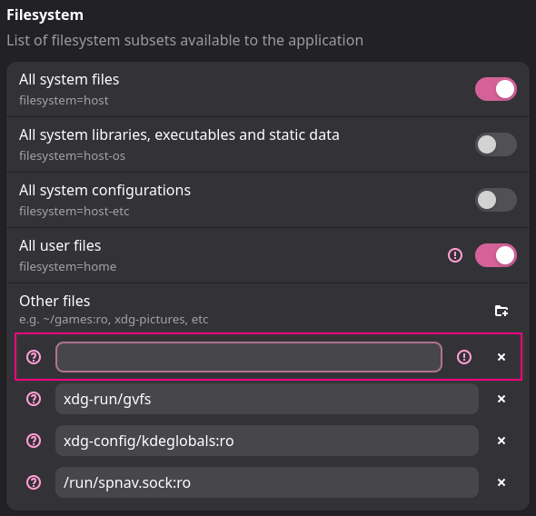

# Installation

How to install and setup the Solar addon.

<br/>

## 1. Addon

Install this addon via the addon manager.

<br/>

## 2. Radiance

To use the Sky Domes functionality, you also  
need to install the **[Radiance]** project which  
currently has to be done using their installers.

Head over to their **[Releases]** page, download  
the installer for your system and go through it.

### Flatpak

If you are using the Flatpak version of FreeCAD  
you have to also give it access to the Radiance  
files, the easiest way is to use **[Flatseal]**.

In Flatseal find the FreeCAD entry and scroll to  
the section named `Filesystem`, there you can  
give FreeCAD access to additional directories.

Add a directory called `~/ladybug_tools`



### Snap

Snaps don't have access to files outside by default.  
To determine where the Radiance files should go, run  
the following code inside of FreeCAD Python console.

```Python
from ladybug.config import folders
print(f'{ folders.ladybug_tools_folder }')
```

<br/>

## 3. Integrations

If you want to use the integrations into the  
`Render` & `Movie` addons, simply install  
those via the addon manager.


[FlatSeal]: https://flathub.org/en/apps/com.github.tchx84.Flatseal
[Releases]: https://github.com/LBNL-ETA/Radiance/releases
[Radiance]: https://www.radiance-online.org/