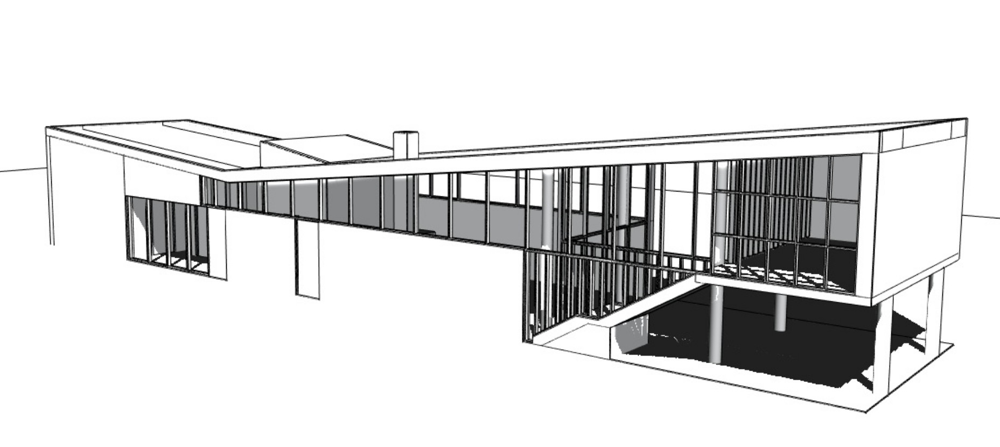
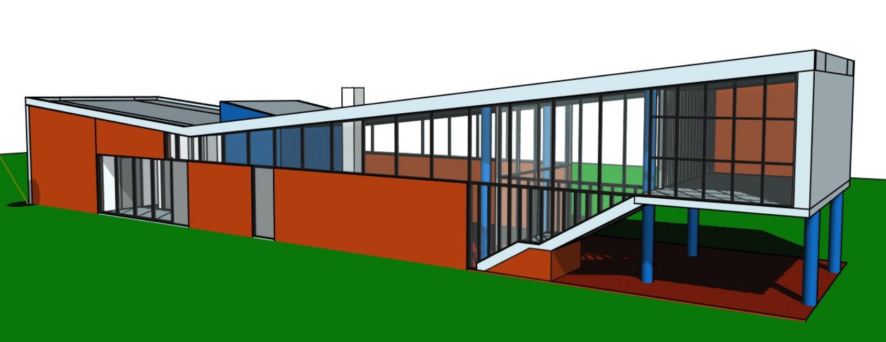
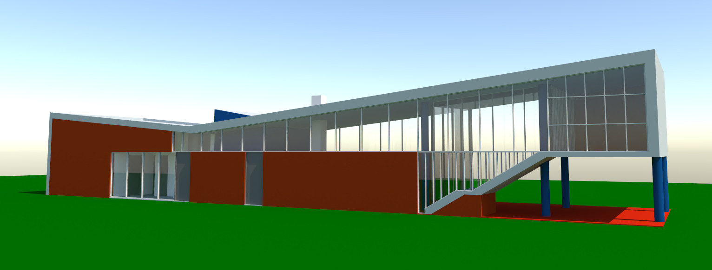
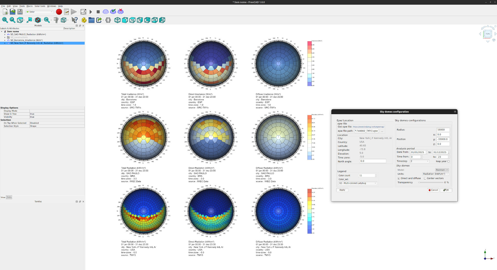
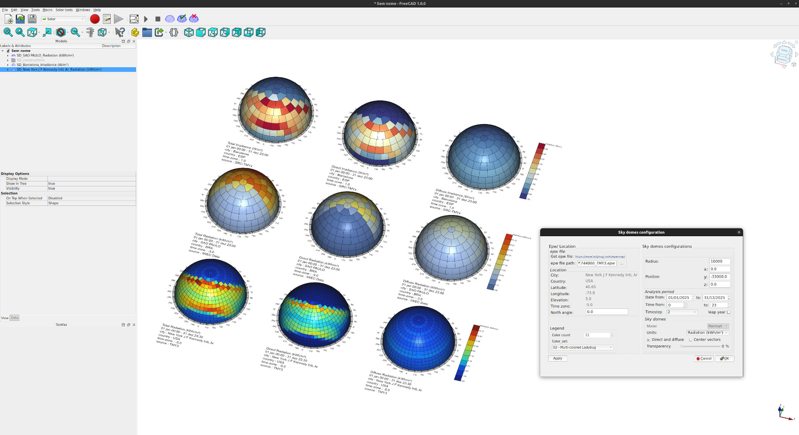

# Tutorial

Study of the sun path.

<table>
<tr>
<th>Grayscale</th>
<th>Colorized</th>
<th>Rendered</th>
</tr>
<tr>
<td>

</td>
<td>

</td>
<td>

</td>
</tr>
</table>

 

## Setting the sun path and its animation

Video with object animation by Sketches.

## Sky Domes Analysis

<table>
<tr>
<td>

</td>
<td>

</td>
</tr>
</table>
