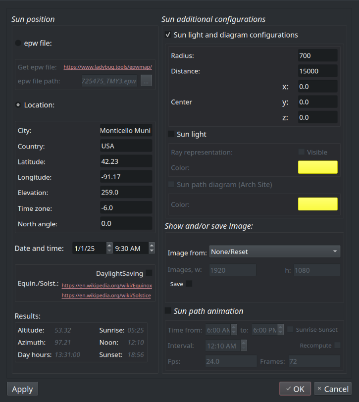
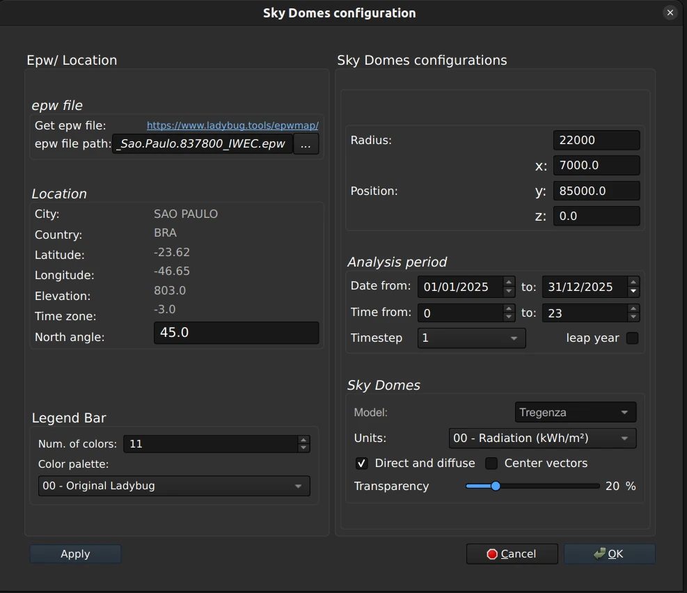

# Usage

## Sun Path Dialog  

Here you can configure your sun path.

 

## Sky Domes Dialog

Here you can configure your sky domes.

To create a SkyDomes, click "Create SkyDomes" button and configure them in the dialog window. To modify a SkyDomes, click "Modify SkyDomes" button with the respective SkyDomes already selected. To delete SkyDomes, select them and click "Delete SkyDomes" button.

## Sun Analysis Dialog

Here you can configure the sun analysis.

To get a SunAnalysis, first you need to create simple volumes of what you want to analyze. Preferably, use dimensions in meters, as the results adopt this unit.

Place these volumes in a group created only for that.

Select the previous group, click the "CreateSunanalysis" button and configure it in the dialog window:

-  In the "SunAnalysis configuration" window, download the epw file from the analysis location, using the link in the dialog box, in "Get epw file". Choose the location on the opened website and download the file to your computer.

-  Select the analysis objects in "Study objects" and the context objects in "Study context". If only one object of study is used and there are no other objects interfering with its insolation, it must be repeated in context objects.

-  To speed up the first results, use high values ​​in "Max. length", for example, 4,000 (4m). If you notice that some faces are not being calculated, increase the value of ""Offset distance", this is related to the previous one ("Max. length"), increasing one should increase the other and vice versa.

-  Define the analysis period.

-  Choose the results

To modify a SunAnalysis, click "Modify Sun Analysis" button with the respective SunAnalysis already selected. To delete SunAnalysis, select it and click "Delete SunAnalysis" button.

IMPORTANT: 

* Once Skydomes and SunAnalysis are created, do not modify the group structure in the FreeCAD object tree, as this will prevent future modifications.

* This is the first implementation of sky domes and sun analysis using the ladybug libraries; therefore, the results obtained may still contain errors or deviations. So, they should be considered EXPERIMENTAL and are NOT yet recommended for use in professional work. They must be verified in some way.

* If you find any inconsistencies, or even confirmations, please report it in the forum link indicated on preview page as "Discussions".
