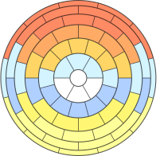
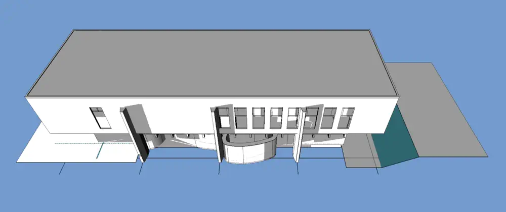
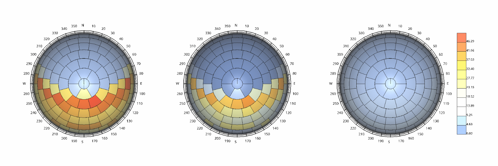
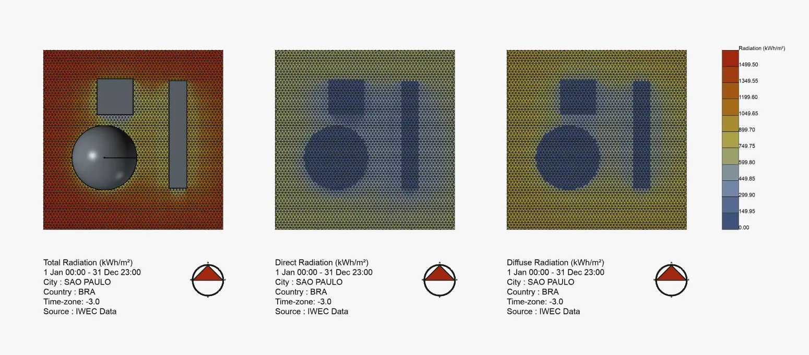
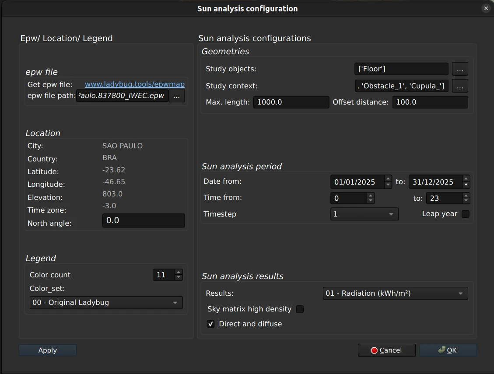

## Solar Workbench
Workbench to manage solar  
analysis and configurations.

 

[![Button Installation]][Installation] 
[![Button Usage]][Usage] 
[![Button Discussions]][Discussions]

 

## Features

### Sun Path

Visualize the path the sun takes in real-time.

#### Record & Play

Integrates with the `Movie` & `Render` workbenches.

### Sky Domes

Generate sky dome diagrams for your models.

### Sun Analysis

Generate sun irradiation analysis diagrams for your models.

#### Dialogs

-   Pre-configure the sun from `.epw` files.

-   Manually adjust any setting of the sun.

-   Use a stand-in for the sun to aid analysis.

-   Diagram with time, equinoxes & solstices.

-   Save images of the obtained results.

 

[Button Installation]: https://img.shields.io/badge/Installation-d45558?style=for-the-badge&logoColor=white&logo=openlayers
[Button Discussions]: https://img.shields.io/badge/Discussions-ffaa00?style=for-the-badge&logoColor=white&logo=freecad
[Button Usage]: https://img.shields.io/badge/Usage-3b8ad9?style=for-the-badge&logoColor=white&logo=searxng

[Installation]: ./Documentation/Installation.md
[Discussions]: https://forum.freecad.org/viewtopic.php?p=836631
[Usage]: ./Documentation/Usage.md
