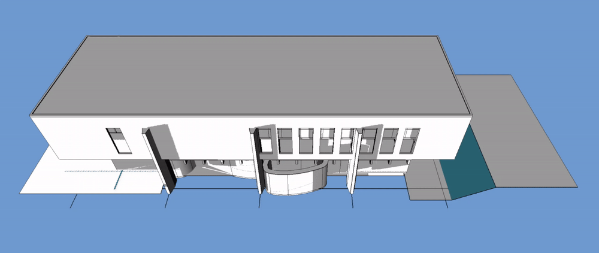

# Solar

Workbench to manage solar analysis and configurations.

## Setup

After installing this addon, please follow the [Setup] guide.

## Features

### Sky Domes

Generate sky dome diagrams for your models.

### Dialogs

-   Pre-configure the sun from `.epw` files.

-   Manually adjust any setting of the sun.

-   Use a stand-in for the sun to aid analysis.

-   Diagram with time, equinoxes & solstices.

-   Save images of the obtained results.

### Sun Path

Visualize the path the sun takes in real-time.

### Record & Play

Integrates with the `Movie` & `Render` workbenches.

[Setup]: https://github.com/Francisco-Rosa/Solar/Documentation/Installation